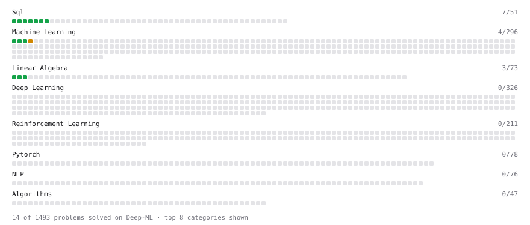

# Deep-ML

My machine learning practice from [Deep-ML](https://www.deep-ml.com). Every solution here was written by hand.

**15** solved · 15 problems · 0 labs · 0 math

[**Browse the interactive portfolio**](https://IsaacHusaiin.github.io/deep-ml/) to replay this filling in over time.

## Problems

| | Difficulty | Solved | |
| --- | --- | --- | --- |
| [Calculate Mean by Row or Column](https://www.deep-ml.com/problems/4) | easy | 2026-10-01 | [solution](problems/0004-calculate-mean-by-row-or-column) |
| [Count rows per group](https://www.deep-ml.com/problems/1107) | easy | 2026-09-30 | [solution](problems/1107-count-rows-per-group) |
| [Feature Scaling Implementation](https://www.deep-ml.com/problems/16) | easy | 2026-09-27 | [solution](problems/0016-feature-scaling-implementation) |
| [Filter rows with WHERE](https://www.deep-ml.com/problems/1103) | easy | 2026-09-28 | [solution](problems/1103-filter-rows-with-where) |
| [Linear Regression Using Gradient Descent](https://www.deep-ml.com/problems/15) | easy | 2026-09-23 | [solution](problems/0015-linear-regression-using-gradient-descent) |
| [Linear Regression Using Normal Equation](https://www.deep-ml.com/problems/14) | easy | 2026-09-23 | [solution](problems/0014-linear-regression-using-normal-equation) |
| [Matrix-Vector Dot Product](https://www.deep-ml.com/problems/1) | easy | 2026-09-30 | [solution](problems/0001-matrix-vector-dot-product) |
| [Remove duplicates with DISTINCT](https://www.deep-ml.com/problems/1105) | easy | 2026-09-28 | [solution](problems/1105-remove-duplicates-with-distinct) |
| [Reshape Matrix](https://www.deep-ml.com/problems/3) | easy | 2026-10-01 | [solution](problems/0003-reshape-matrix) |
| [SELECT all rows](https://www.deep-ml.com/problems/1101) | easy | 2026-09-28 | [solution](problems/1101-select-all-rows) |
| [Select specific columns](https://www.deep-ml.com/problems/1102) | easy | 2026-09-28 | [solution](problems/1102-select-specific-columns) |
| [Sort results with ORDER BY](https://www.deep-ml.com/problems/1104) | easy | 2026-09-28 | [solution](problems/1104-sort-results-with-order-by) |
| [Top N with LIMIT](https://www.deep-ml.com/problems/1106) | easy | 2026-09-30 | [solution](problems/1106-top-n-with-limit) |
| [Transpose of a Matrix](https://www.deep-ml.com/problems/2) | easy | 2026-09-30 | [solution](problems/0002-transpose-of-a-matrix) |
| [K-Means Clustering](https://www.deep-ml.com/problems/17) | medium | 2026-09-28 | [solution](problems/0017-k-means-clustering) |

---

_This file is regenerated by Deep-ML on every push._
